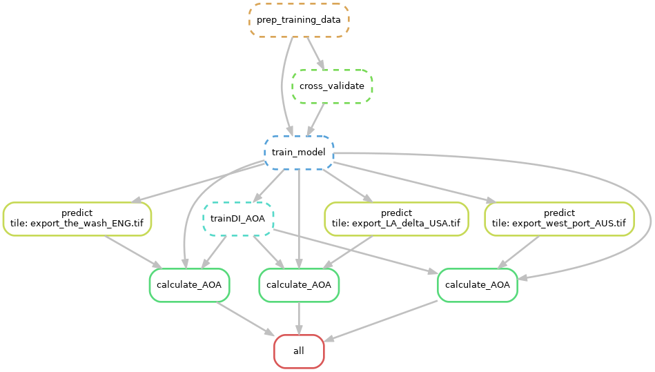

# global-marshC-map
Scripts and data to model and map soil carbon in tidal marshes

# Repository structure

- `reports/01_covariate_layers/`: folder containing scripts with tests for processing covariate layers (i.e. clipping tiles, combining tiles).

- `reports/02_data_process/`: folder containing data processing scripts.
    - `marsh_data_process.smk`: snakemake file to run all scripts in this folder. Note: input data *import_SaltmarshC* is export from another repository. Will be hardcoded in final version (minor changes to be made). Second input data *import_GEE_data* located in /03_modelling.
    - `scripts/`: 
        - scripts run during snakemake: 
            -  `01_uniqueID_location.R`: ensure unique ID per location (especially for data coming from the Coastal Carbon Network)
            -  `02_point_locations.R`: manual check of data point locations.
            -  `03_bulk_density.R`: generate a transfer equation using samples with both bulk density and soil organic matter measured (both observed and estimated from soil organic carbon). Use this equation to estimate bulk density for samples without measured values. 
            -  `04_calculate_OCD`: Calculate organic carbon density for each sample (OC content x bulk density). This is the response for the model. 
        - Other scripts:  
            -   `exploratory/` : subfolder with previous test scripts (to be deleted).
    - `snakesteps/`: folder with output from snakemake file (i.e. output of all the scripts above).

- `reports/03_modelling/`: **folder containing all modelling scripts**
    - `marshC.smk`: snakemake file to run all scripts in this folder. 
    - `data/`: All input data for the marshC.smk file. Note: input data *data_clean_SOCD.csv* is the output from the 02_data_process/ folder (currently copied into folder for ease of use with snakemake and the HPC). 
    - `scripts/`: 
        - scripts run during snakemake: 
          - `01_training_data.R`: combine data exported from Google Earth Engine (covariate values at each location) with the full SOCD data file (several depths at one location).
          - `02_cross-validation.R`: prepare CV folds with two methods to compare: spatial CV (similar to grid method from [Ludwig et al. 2023](https://doi.org/10.1111/geb.13635)) and knndm CV (from [Linnenbrink et al. 2023](http://dx.doi.org/10.5194/egusphere-2023-1308)).
          - `03_train_model.R`: train random forest models using `caret` (random, spatial, and knndm to compare). The following steps have been run using both spatial and nndm for comparison.    
          - `04_predictions.R`: predict SOCD at 3 depths (0, 30, and 100 cm), then calculate and return the soil organic carbon stocks (tonnes per hectare) for the 0-30 cm layer (average(SOCD_0cm, SOCD_30cm) * 30cm) and for the 30-100cm layer (average(SOCD_30cm, SOCD_100cm) * 70cm).
          - `05_trainDI_AOA.R`: train the difference index for area of applicability (AOA) from [Meyer & Pebesma 2021](https://doi.org/10.1111/2041-210X.13650). **Note: currently I could only get the trainDI() function to work by copying the contents of the function in this script.**
          - `06_AOA.R`: calculate aoa. **Note: I've been having issues reading the exported aoa using readRDS(), so the contents of error metric and visualization scripts are in this script**: creates graphs with predictionDI vs trainDI, predictions &  AOA, for each soil layer (0-30cm and 30-100cm). Calculates error metric and generates a graph with the error model and the expected error, for each soil layer. 
          - `07_Errormetric.R`:
          - `08_visualizeAOA_DI.R`:
        - Other scripts: 
            - `setup_HPC_Renv.txt` : R packages downloaded on the HPC via the command line to complement the conda environment (note: there may be some I downloaded a while ago that I haven't added here - I'll need to test this). 
            - Scripts directly downloaded from the [CAST](https://github.com/HannaMeyer/CAST/tree/master/R) package: `DItoErrormetric.R`, `knndm.R`, `trainDI.R`. 
            - `exploratory/` : subfolder with previous test scripts (to be deleted).
    - `snakesteps/`:  folder with output from snakemake file (i.e. output of all the scripts above).
    - `hpc_tidal_env.yaml`: conda environment used to run snakemake on the HPC. Note: several R packages had to be added manually to the environment on the HPC via the command line (see file `setup_HPC_Renv.txt` in the scripts folder).

- `reports/04_model_tests/`: folder containing scripts with tests (not yet refined - likely to be deleted/changed, currently used as a backup).

- `reports/05_figures/`: folder containing scripts to generate figures (not yet refined - likely to be deleted/changed, currently used as a backup).

# Processing steps

- Prepare environmental covariates in Google Earth Engine (GEE) - expand to cover entire saltmarsh area
- Export to Google Drive, rclone to HPC tiles folder
- Test code locally and on Ubuntu subsystem using snakemake file
- copy data and scripts file to HPC (to update files on HPC)
- Run snakemake on HPC with slurm to run all modelling scrips and predict in parallel 

# Current test steps 

- ~~Ensure R code runs on Ubuntu subsystem (same tidal environment as on the HPC)~~
- ~~Ensure marshC.smk snakemake code runs on Ubuntu and debug~~
- ~~Test marshC.smk snakemake file on HPC with small random test tiles~~
- ~~Test marshC.smk snakemake on HPC with real key locations~~ 
    - ~~ To do: compare to previous maps (see section below) ~~ 
    - ~~ To do: debug exporting aoa to be able to read in another file ~~ 
- Compare predictions at key locations, when training model with data extracted at native resolution vs data extracted at resampled resolution
- ~~ Run predictions for the world at 1km scale ~~ 

##  Comparing to previous maps

geometry: LA_delta_USA

1. Holmquist, J. R. et al. Accuracy and Precision of Tidal Wetland Soil Carbon Mapping in the Conterminous United States. Sci Rep 8, 9478 (2018).

geometry: west_port_AUS

2. Lewis, C. J. E. et al. Drivers and modelling of blue carbon stock variability in sediments of southeastern Australia. Biogeosciences 17, 2041–2059 (2020).

geometry: the_wash_ENG

3. Smeaton, C. et al. Using citizen science to estimate surficial soil Blue Carbon stocks in Great British saltmarshes. Frontiers in Marine Science 9, 959459 (2022).
