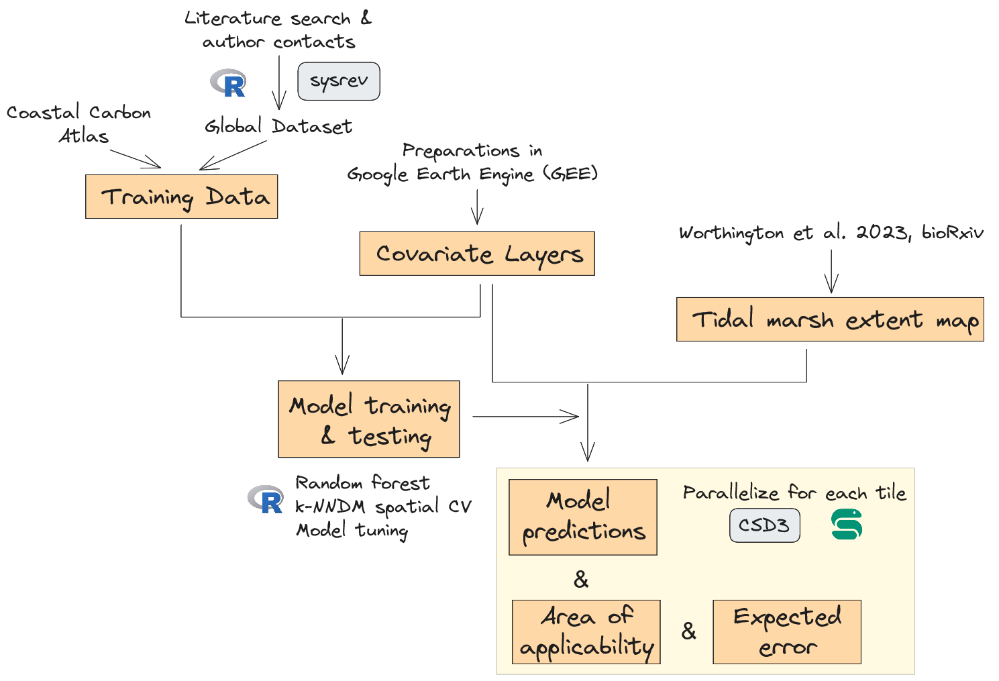
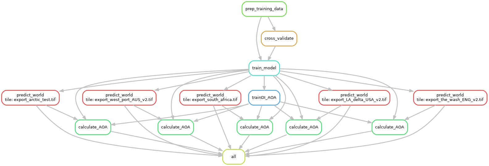
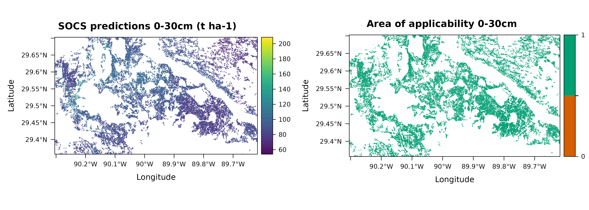
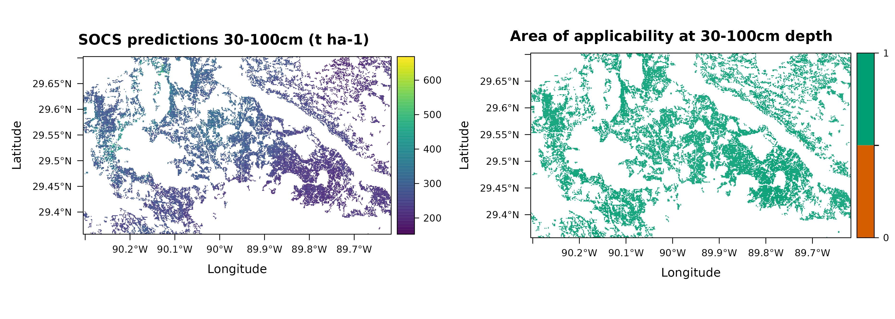
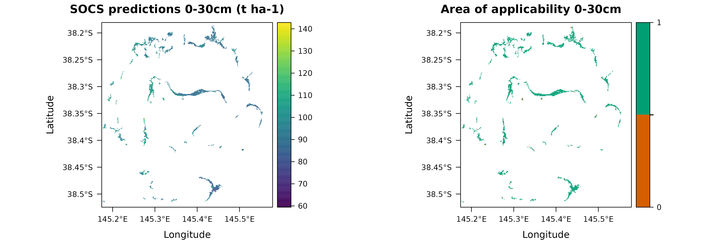
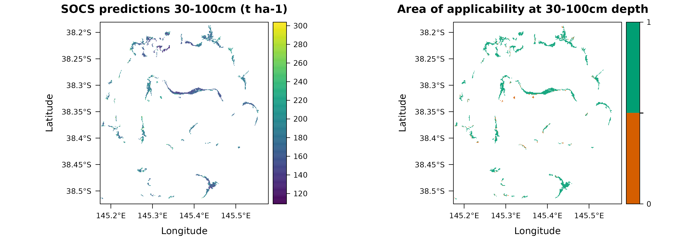
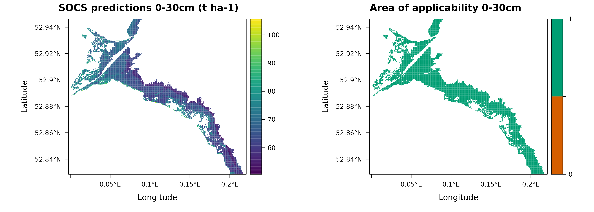
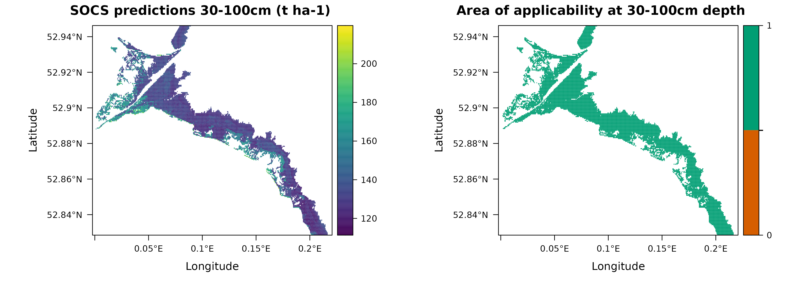

# Global marsh SOC modelling 
Scripts and data to model and map soil organic carbon in tidal marshes. 




# Repository structure

## Covariate layer preparations
- `reports/01_covariate_layers/`: folder containing scripts used in Google Earth Engine to prepare the covariate layers. 

## Training data processing 

- `reports/02_data_process/`: folder containing data processing scripts.
    - `marsh_data_process.smk`: snakemake file to run all scripts in this folder. 
    - `data/`: folder with input data for the marsh_data_process.smk file. 
    - `scripts/`: 
        - scripts run during snakemake: 
            -  `01_uniqueID_location.R`: ensure unique ID per location (especially for data coming from the Coastal Carbon Network)
            -  `02_point_locations.R`: manual check of data point locations.
            -  `03_bulk_density.R`: generate a transfer equation using samples with both bulk density and soil organic matter measured (both observed and estimated from soil organic carbon). Use this equation to estimate bulk density for samples without measured values. 
            -  `04_calculate_OCD`: Calculate organic carbon density for each sample (OC content x bulk density). This is the response for the model. 
    - `snakesteps/`: folder with output from snakemake file (i.e. output of all the scripts above).

## Modelling

- `reports/03_modelling/`: folder containing all modelling scripts.
    - `marshC.smk`: snakemake file to run all scripts in this folder. Example command line to use Snakemake with slurm on an HPC found in the `command_ex_runSnakemake.txt` file. 
    - `hpc_tidal_env.yaml`: conda environment "tidal" used to run snakemake on the HPC. Note: several R packages had to be added manually to the environment on the HPC in R (see file `setup_HPC_Renv.txt`).
    - `data/`: All input data for the marshC.smk file. Note: input data *data_clean_SOCD.csv* is the output from the 02_data_process/ folder (copied into folder for ease of use with snakemake and the HPC). 
    - `scripts/`: 
        - scripts run during snakemake: 
            - `01_training_data.R`: combine data exported from Google Earth Engine (covariate values at each location) with the full SOCD data file (several depths at one location).
            - `02_cross-validation.R`: prepare CV folds with two methods to compare: spatial CV (similar to grid method from [Ludwig et al. 2023](https://doi.org/10.1111/geb.13635)) and knndm CV (from [Linnenbrink et al. 2023](http://dx.doi.org/10.5194/egusphere-2023-1308)).
            - `03_train_model.R`: train random forest models using `caret` (random, spatial, and knndm to compare). The final model used was model_nndm.    
            - `04_predictions.R`: predict SOCD at 3 depths (0, 30, and 100 cm), then calculate and return the soil organic carbon stocks (tonnes per hectare) for the 0-30 cm layer (average(SOCD_0cm, SOCD_30cm) * 30cm) and for the 30-100cm layer (average(SOCD_30cm, SOCD_100cm) * 70cm).
            - `05_trainDI_AOA.R`: train the difference index for area of applicability (AOA) from [Meyer & Pebesma 2021](https://doi.org/10.1111/2041-210X.13650). 
            - `06_AOA_bis.R`: calculate AOA in the same steps as the predicitons (at 3 depths, then averaged for both soil layers). Creates graphs with predictionDI vs trainDI, predictions &  AOA, for each soil layer (0-30cm and 30-100cm). Calculates error metric and generates a graph with the error model and the expected error, for each soil layer. Note: with this method, some depths could have an AOA of 0.5. We only considered an AOA value of 1 for the depth in the pixel to be inside the AOA.  
        - Other scripts: 
            - `func_fig_pred`: function created to plot figures. Used in the 06_AOA_bis. R script. 
            - Scripts directly downloaded from the developper's version of the [CAST](https://github.com/HannaMeyer/CAST/tree/master/R) package, commit version from August 2023: `DItoErrormetric.R`, `knndm.R`, `trainDI.R`, `fold2index.R`. Note: these functions are now implemented in the CRAN version of CAST.   
    - `snakesteps/`:  folder with output from snakemake file (i.e. output of all the scripts above).





## Other analyses

- `reports/04_model_tests/`: folder containing scripts with tests (size of CV grid and model tuning steps - note, these were done before the final run of the model in step 03_modelling). 

- `reports/05_figures/`: folder containing scripts to generate figures. 

- `reports/06_analysis/`: folder containing scripts to generate figures. 


#  Comparing to previous maps

## LA_delta_USA





Reference for comparison: Holmquist, J. R. et al. Accuracy and Precision of Tidal Wetland Soil Carbon Mapping in the Conterminous United States. _Scientific Reports_ 8, 9478 (2018).

## west_port_AUS





Reference for comparison: Lewis, C. J. E. et al. Drivers and modelling of blue carbon stock variability in sediments of southeastern Australia. _Biogeosciences_ 17, 2041–2059 (2020).

## the_wash_ENG





Reference for comparison: Smeaton, C. et al. Using citizen science to estimate surficial soil Blue Carbon stocks in Great British saltmarshes. _Frontiers in Marine Science_ 9, 959459 (2022).

## south_africa


## arctic_test 


# Citation

```
@article{maxwell_biorxiv_2023,
    title = {Global dataset of soil organic carbon in tidal marshes},
    author = {Maxwell, Tania L. and Spalding, Mark D. and Friess, Daniel A. and Murray, Nicholas J. and Rogers, Kerrylee and Rovai, André S. and Smart, Lindsey S. and Weilguny, Lukas and Adame, Maria Fernanda and Adams, Janine B. and Copertino, Margareth and Cott, Grace M. and Duarte de Paula Costa, Micheli and Holmquist, James R. and Ladd, Cai J.T. and Lovelock, Catherine E. and Ludwig, Marvin and Moritsch, Monica M. and Navarro, Alejandro and Raw, Jacqueline L. and Ruiz-Fernández, Ana Carolina and Serrano, Oscar and Smeaton, Craig and Van de Broek, Marijn and Windham-Myers, Lisamarie and Landis, Emily and Worthington, Thomas A.},
    year = {2023},
    journal = {BioRxiv},
    doi = {}
}
``` 


# Contact 

For any queries, please contact Tania L. Maxwell (taniamaxwell7 [at] gmail.com). 

# Version History 

v1 | April 5, 2024 | First release for BioRxiv 
